# qed

A terminal text editor written in [Odin](https://odin-lang.org), inspired by
[micro](https://micro-editor.github.io). Ctrl-based keybinds (`Ctrl+S` save,
`Ctrl+C`/`Ctrl+V` copy/paste, `Ctrl+F` find) instead of modal editing, plus
IDE-lite features: syntax highlighting, LSP, git integration, and LLM assist.
Runs on Linux and macOS in any truecolor terminal.

<p align="center">
  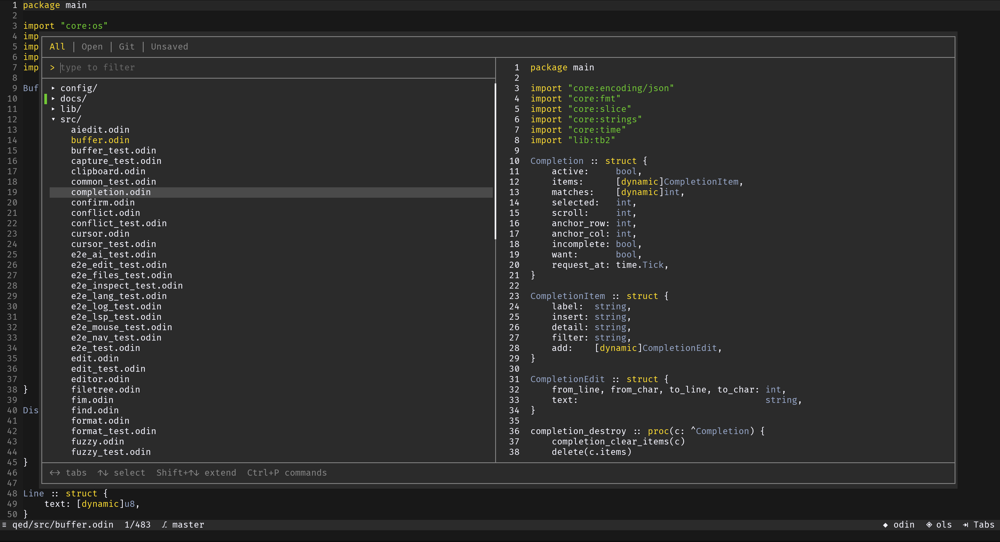
</p>

## Contents

- [Features](#features)
- [Screenshots](#screenshots)
- [Installation](#installation)
- [Quickstart](#quickstart)
- [Dependencies](#dependencies)
- [Configuration](#configuration)

## Features

- **Editing:** Unicode/grapheme-aware cursor, soft wrap, multiple buffers,
  grouped undo/redo, auto-indent, auto-close pairs, block indent, comment toggle,
  word/paragraph motion with held-key acceleration.
- **Syntax highlighting:** tree-sitter for 20 languages, theme-driven, with
  injection (code blocks in Markdown, `<script>`/`<style>` in HTML).
- **Language servers:** diagnostics, go-to-definition, hover, workspace-wide
  rename, as-you-type completion, document formatting.
- **Git:** diff gutter, inline diff view, per-file diff preview, branch and
  ahead/behind in the status bar, merge-conflict highlighting and resolve.
- **Navigation:** file tree (open/copy/rename/delete/search), fuzzy line jump,
  project search (ripgrep), find/replace (regex, smart-case), command palette
  (`Ctrl+P`).
- **Embedded terminal:** persistent full-TUI shell in a floating pane (`Alt+t`),
  with mouse, scrollback, and copy/paste.
- **AI (optional):** selection-and-prompt edits via a chat command (`Ctrl+K`),
  inline FIM ghost-text completion.
- **Configuration:** JSON knobs, keybinds, and colors, hot-reloaded from
  `~/.config/qed/`.

## Screenshots

<table>
<tr>
<td width="50%">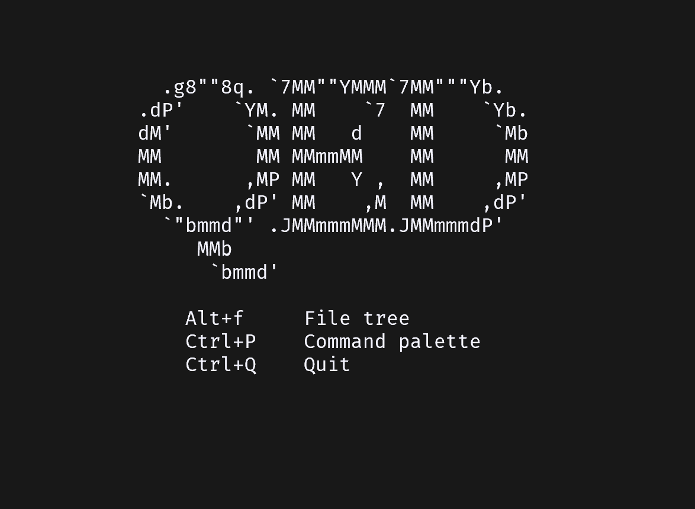<br><em>Welcome screen: working root, git branch, startup keys.</em></td>
<td width="50%">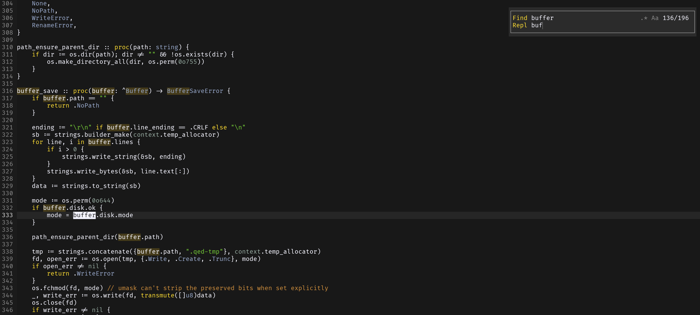<br><em>Find &amp; replace: regex, smart-case, live match count, all hits highlighted.</em></td>
</tr>
<tr>
<td width="50%">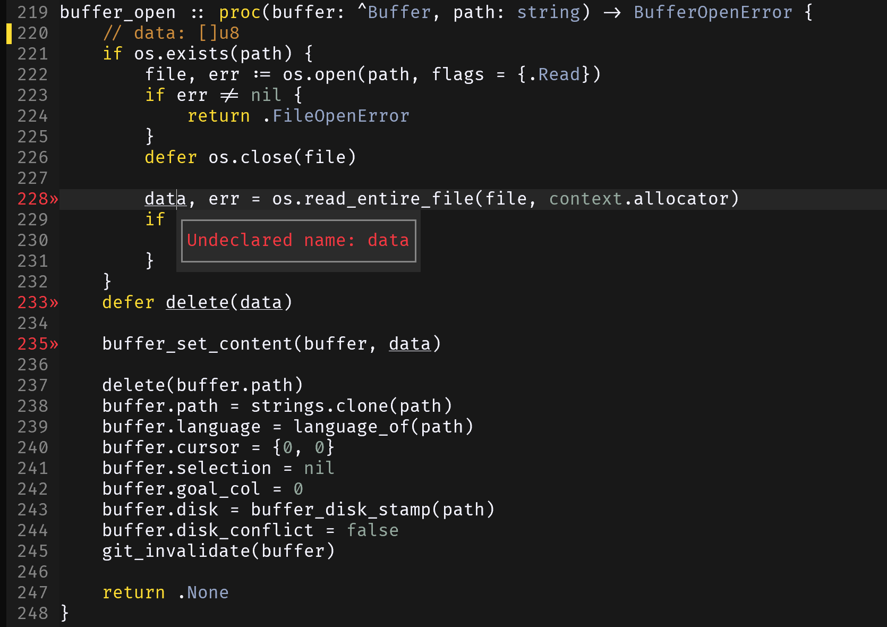<br><em>LSP diagnostics: inline underline, gutter severity, error popup.</em></td>
<td width="50%">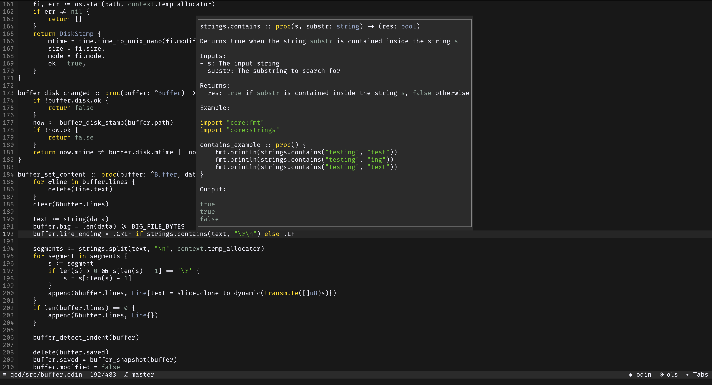<br><em>Hover: rendered-markdown docs from the language server.</em></td>
</tr>
<tr>
<td width="50%">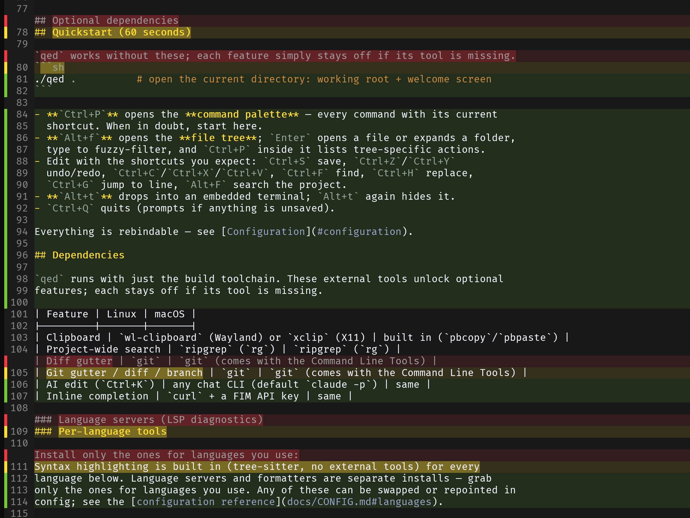<br><em>Inline diff view: removed lines as ghost rows with word-level highlight.</em></td>
<td width="50%">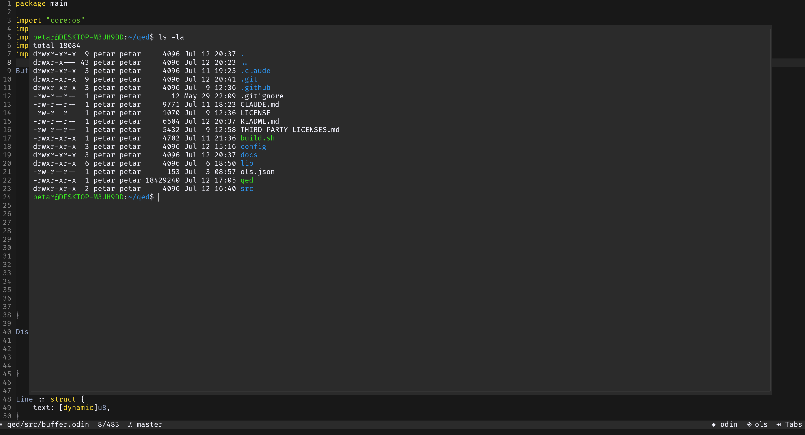<br><em>Embedded terminal: persistent full-TUI shell in a floating pane.</em></td>
</tr>
<tr>
<td width="50%">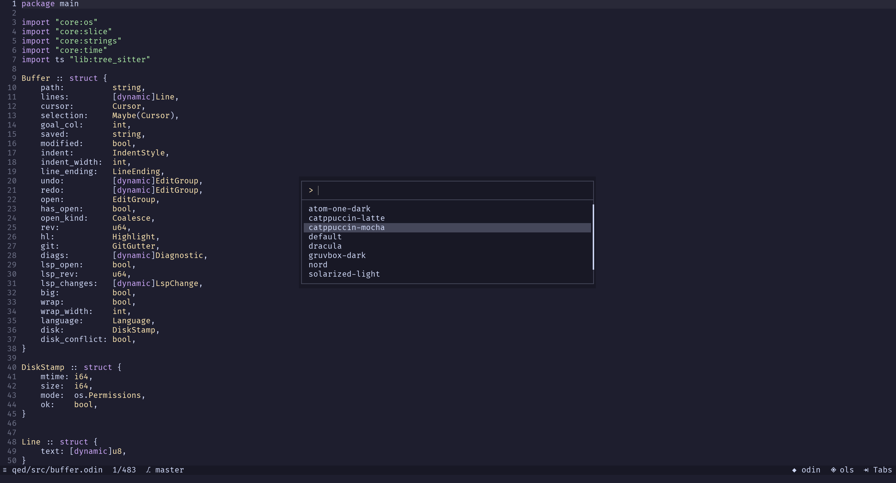<br><em>Set Theme: instant-preview picker over the bundled themes.</em></td>
<td width="50%">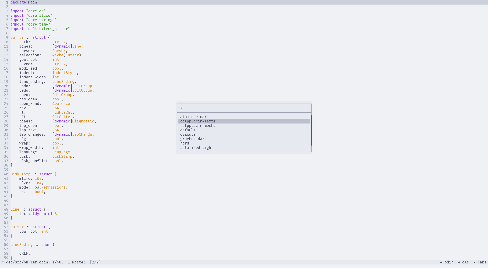<br><em>Light theme (catppuccin-latte) with the theme picker open.</em></td>
</tr>
<tr>
<td width="50%">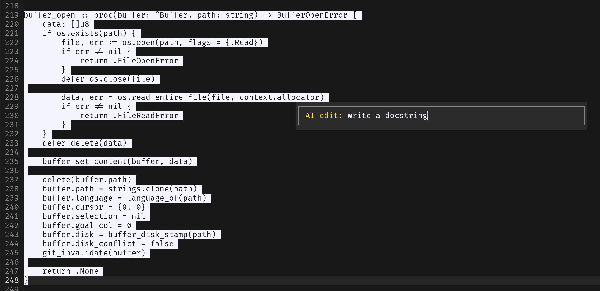<br><em>AI edit: select a region, describe the change (<code>Ctrl+K</code>).</em></td>
<td width="50%">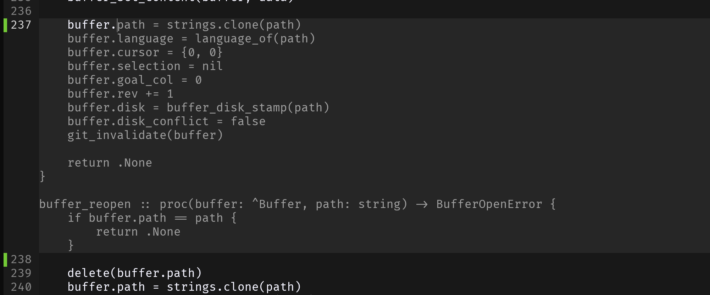<br><em>Inline completion: dimmed FIM ghost-text, accepted with <code>Tab</code>.</em></td>
</tr>
<tr>
<td width="50%">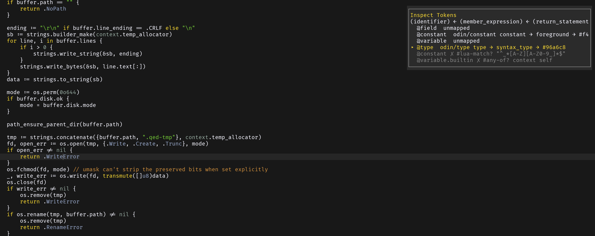<br><em>Inspect Tokens: live tree-sitter capture and color resolution.</em></td>
<td width="50%">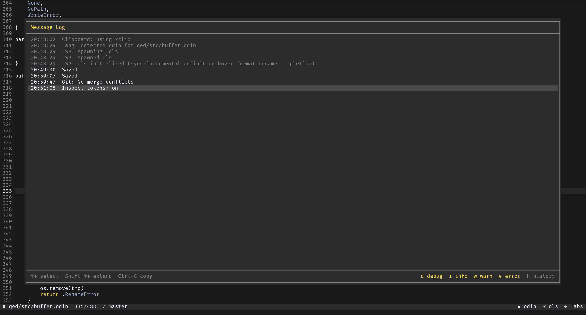<br><em>Message Log: timestamped, level-filtered, cross-session.</em></td>
</tr>
</table>

## Installation

### Download a release binary

Prebuilt for `linux-amd64`, `linux-arm64`, `macos-amd64`, and `macos-arm64` on
the [Releases](https://github.com/PetarPeychev/qed/releases/latest) page. No
toolchain required.

```sh
# Replace VERSION and PLATFORM with the file you downloaded, e.g.
#   qed-v1.0.0-linux-amd64.tar.gz
tar xzf qed-VERSION-PLATFORM.tar.gz
cd qed-VERSION-PLATFORM
./qed [PATH]        # PATH is a file or directory; omit for the welcome screen
```

Move or symlink `qed` into a directory on your `PATH` (e.g. `~/.local/bin`) to
run it from anywhere. On macOS, first launch may need `xattr -d
com.apple.quarantine ./qed` to clear Gatekeeper.

### Build from source

Requires [Odin](https://odin-lang.org/docs/install/) (bundles LLVM) and a C
compiler (`cc`) plus `ar` for the vendored termbox2 and tree-sitter static
libraries.

```sh
# Linux toolchain (Debian/Ubuntu; adjust for your distro)
sudo apt install build-essential git
# macOS toolchain
xcode-select --install && brew install odin

git clone https://github.com/PetarPeychev/qed.git && cd qed
./build.sh
./qed [PATH]
```

## Quickstart

```sh
./qed .          # open the current directory: working root + welcome screen
```

- `Ctrl+P`: command palette, lists every command with its shortcut.
- `Alt+f`: file tree. `Enter` opens a file or expands a folder, type to
  fuzzy-filter, `Ctrl+P` lists tree actions.
- `Ctrl+S` save, `Ctrl+Z`/`Ctrl+Y` undo/redo, `Ctrl+C`/`Ctrl+X`/`Ctrl+V`,
  `Ctrl+F` find, `Ctrl+H` replace, `Ctrl+G` go to line, `Alt+F` project search.
- `Alt+t`: toggle the embedded terminal.
- `Ctrl+Q`: quit (prompts if anything is unsaved).

All keybinds are rebindable. See [Configuration](#configuration).

## Dependencies

qed needs no external tools to run. The following enable optional features; each
stays off when its tool is missing.

| Feature | Linux | macOS |
|---------|-------|-------|
| Clipboard | `wl-clipboard` (Wayland) or `xclip` (X11) | built in (`pbcopy`/`pbpaste`) |
| Project search | `ripgrep` (`rg`) | `ripgrep` (`rg`) |
| Git gutter / diff / branch | `git` | `git` (Command Line Tools) |
| AI edit (`Ctrl+K`) | any chat CLI (default `claude -p`) | same |
| Inline completion | `curl` + a FIM API key | same |

### Per-language tools

Syntax highlighting is built in for every language below. Language servers and
formatters are separate installs; install the ones for languages you use. Any
can be swapped in config (see the
[configuration reference](docs/CONFIG.md#languages)).

| Language | Highlight | Language server | Formatter |
|----------|:---------:|-----------------|-----------|
| Odin | ✓ | [ols](https://github.com/DanielGavin/ols) | |
| Python | ✓ | [pyright](https://github.com/microsoft/pyright) | [ruff](https://github.com/astral-sh/ruff) |
| C / C++ | ✓ | [clangd](https://clangd.llvm.org) | |
| Go | ✓ | [gopls](https://pkg.go.dev/golang.org/x/tools/gopls) | `gofmt` |
| Rust | ✓ | [rust-analyzer](https://rust-analyzer.github.io) | `rustfmt` |
| JavaScript / JSX | ✓ | [typescript-language-server](https://github.com/typescript-language-server/typescript-language-server) | |
| TypeScript / TSX | ✓ | typescript-language-server | |
| HTML | ✓ | [vscode-langservers-extracted](https://github.com/hrsh7th/vscode-langservers-extracted) | |
| CSS | ✓ | vscode-langservers-extracted | |
| Shell | ✓ | [bash-language-server](https://github.com/bash-lsp/bash-language-server) | |
| Lua | ✓ | [lua-language-server](https://github.com/LuaLS/lua-language-server) | |
| YAML | ✓ | [yaml-language-server](https://github.com/redhat-developer/yaml-language-server) | |
| TOML | ✓ | [taplo](https://taplo.tamasfe.dev) | `taplo fmt -` |
| Dockerfile | ✓ | [docker-langserver](https://github.com/rcjsuen/dockerfile-language-server) | |
| JSON | ✓ | | |
| SQL | ✓ | | |
| Markdown | ✓ | | |

## Configuration

Defaults are compiled into the binary. `~/.config/qed/config.json` overrides them
as a sparse per-key diff (only the keys you set), hot-reloaded on save. qed never
writes it. Colors live in themes; set `"theme"` or use the *Set Theme* picker.

Full reference of knobs, keybinds, languages, and theme keys:
[configuration reference](docs/CONFIG.md). It links to the canonical defaults,
[`config/config.json`](config/config.json) and
[`config/themes/default.json`](config/themes/default.json).
